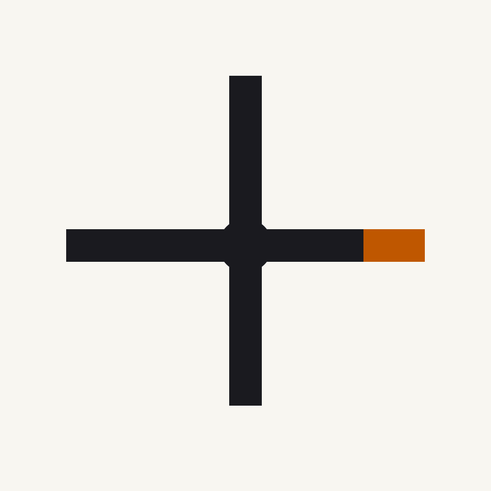

  

<h1 align="center">B-Tree Labs</h1>

  <em>Research-grade infrastructure for agentic systems.</em>

---

Axiom Labs builds the substrate that composable agentic systems run on — memory,
federation, classification, governance — and publishes the research that
motivates the design. Everything here is open-source under permissive licenses.

## Active products

| Project | What it does | Status |
|---|---|---|
| **Axiom** | Domain-agnostic agentic platform — unified composition memory, federation, extensions | In development |
| **Dendra** | Graduated-autonomy classification primitive (rule → LLM → ML in six phases, library-first) | Public v0.2 |
| More | Four additional products in the portfolio | In preparation |

## Papers

The lab publishes a five-paper portfolio on graduated-autonomy classification,
federated composition memory, and agentic system design. Drafts and reproduction
scripts ship alongside the code.

## Brand assets

Logo, palette, typography, matplotlib style, and LaTeX preamble live in
[`brand/`](../brand/). Reuse freely under the same licenses as the code.

## Reusable CI workflows

The Python CI, release, docs, and security-scan workflows used across our
repos are published here as reusable `workflow_call` targets. See
[`.github/workflows/`](../.github/workflows/).

## License

All code: Apache-2.0. All documentation and brand assets: CC-BY-4.0 unless a
specific file carries a different SPDX header.

---

Copyright © 2026 B-Tree Ventures, LLC. DBA Axiom Labs.
